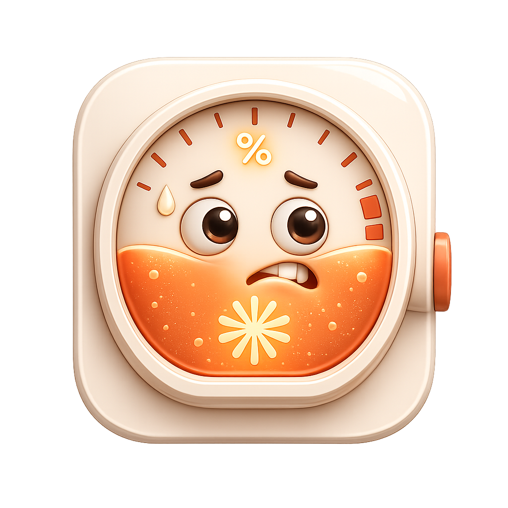
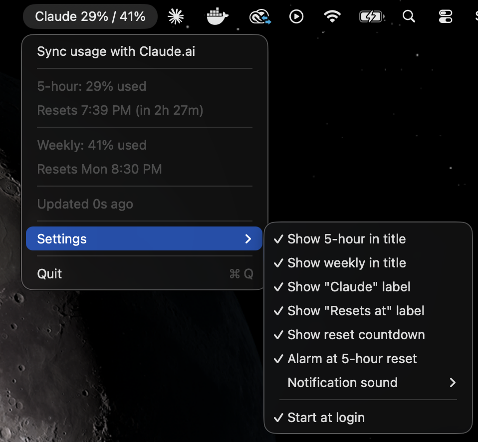

<div align="center">



# ClaudeUsageBar

### See your Claude AI usage limits live in the macOS menu bar

Track your **Claude 5-hour limit** and **weekly limit** at a glance — no more opening settings, refreshing the page, or getting surprised by a "you've reached your usage limit" message mid-prompt.

[](#install)
[](#2-load-the-browser-extension)
[](LICENSE)
[](MenuBarApp/main.swift)

</div>

---

> **TL;DR** — A tiny native macOS menu bar app + a browser extension. The extension reads your usage straight from your own logged-in Claude.ai session and shows it in your menu bar like `Claude 35%`. It turns **orange at 75%** and **red at 90%**, and pings you before you hit the wall.

<div align="center">

</div>

## Why?

If you use **Claude**, **Claude Code**, or the **Claude Max / Pro** plans, you live with two invisible meters: a rolling **5-hour session limit** and a **weekly limit**. Anthropic only shows them buried in Settings → Usage. ClaudeUsageBar surfaces them where you'll actually see them — your menu bar — so you can pace your work and never get blindsided by a rate limit again.

## Features

- 📊 **5-hour + weekly usage** — both Claude limits, live in the menu bar (`Claude 35%`).
- 🎨 **Color warnings** — title goes **orange at 75%**, **red at 90%**. Glanceable.
- 🔔 **Threshold notifications** — a macOS alert when any limit crosses 90%, so you can wrap up before you're cut off.
- ⏰ **Reset countdown + alarm** — see exactly when your 5-hour window resets, with an optional alarm at reset time.
- 🔕 **Pick your sound** — choose any macOS system sound for alerts (hover to preview).
- 🧩 **Reads the real numbers** — pulls from Claude.ai's own usage API in your logged-in session. Accurate, not guessed.
- 🪶 **Native & tiny** — pure Swift `NSStatusItem`, no Dock icon, no Electron, negligible resources.
- 🔒 **100% local & private** — your usage never leaves your machine. Talks only to `127.0.0.1`.
- ⚙️ **Customizable title** — show 5-hour, weekly, or both; hide the word "Claude" for a minimal `35%`.
- 🚀 **Start at login** — set it once and forget it.

## Install

### 1. The menu bar app

**Option A — disk image (recommended):**

```bash
./package.sh
open build/ClaudeUsageBar.dmg
```

The disk image bundles everything — the app, the browser **Extension** folder, and an **INSTALL.txt** — on a single drag-to-install screen. Drag `ClaudeUsageBar.app` into **Applications** and launch it from there.

**Option B — build and run directly:**

```bash
./build.sh
open build/ClaudeUsageBar.app
```

The build is ad-hoc code signed (required for start-at-login and notifications). The app appears in the menu bar with **no Dock icon**. It shows `Claude --` until the extension sends data.

> 💡 Launch the app from **/Applications**, not `build/` — `./build.sh` wipes `build/` on every run, which would break the start-at-login registration.

### 2. Load the browser extension

Works in any Chromium browser — **Chrome, Edge, Brave, Arc**.

1. Copy the **Extension** folder somewhere permanent (e.g. `~/Documents`). An unpacked extension must stay on disk — loading it from the disk image breaks once the image ejects.
2. Open `chrome://extensions`.
3. Turn on **Developer mode** (top-right).
4. Click **Load unpacked** and select that **Extension** folder.
5. Open or reload a logged-in [claude.ai](https://claude.ai) tab.

That's it. The menu bar starts updating within a minute.

## Usage

Click the menu bar item for the full breakdown:

```
Sync usage with Claude.ai
───────────────
5-hour:  35% used
Resets 2:43 PM (in 3h 28m)
───────────────
Weekly:  32% used
Resets Mon 8:30 PM
───────────────
Updated 12s ago
───────────────
Settings ▸
  Show 5-hour in title
  Show weekly in title
  Show "Claude" label
  Show "Resets at" label
  Show reset countdown
  Alarm at 5-hour reset
  Notification sound ▸
  ─────────────
  Start at login
───────────────
Quit
```

- **Color coding** — orange ≥ 75%, red ≥ 90%, based on the highest figure shown.
- **At 100%** the 5-hour title flips to the reset time, e.g. `Claude Resets at 2:40 PM`.
- **Minimal mode** — turn off *Show "Claude" label* for a bare `35%`, or show both figures for `35% / 32%`.

You only need a logged-in claude.ai tab open *somewhere* — the Settings/Usage page does **not** have to be open. The extension polls about once a minute and keeps the menu bar fresh on its own.

## How it works

```
claude.ai usage API  →  content.js  →  background.js  →  127.0.0.1:8787  →  Swift app
  (/api/.../usage)       (poll+map)     (relay POST)       (loopback)        (menu bar)
```

1. `content.js` polls Claude.ai's own usage API (`/api/organizations/:id/usage`) from your logged-in tab.
2. `background.js` relays the result as JSON to the local app.
3. The Swift app runs a minimal HTTP server bound to `127.0.0.1:8787` **only** and renders the figures.

## Privacy & security

ClaudeUsageBar is **fully local and client-side**:

- Reads **your own** usage from **your own** logged-in session — no credentials stored, no login, no account.
- Sends data **only** to `http://127.0.0.1:8787` on your machine. Nothing is uploaded anywhere.
- The local server binds to **loopback only**, locks CORS to `https://claude.ai`, rejects mismatched `Host` headers (DNS-rebinding guard), caps request size, and sanitizes every field before it reaches the menu bar.

## FAQ

**How do I see how much Claude usage I have left?**
Install ClaudeUsageBar — it shows your remaining 5-hour and weekly Claude usage as a live percentage in the macOS menu bar.

**Does this work with Claude Code and the Claude Max / Pro plans?**
Yes. It reads whatever limits your account has (5-hour session + weekly), so it works across Claude.ai chat, Claude Code, Max, and Pro.

**Is it safe / does it have my Claude password?**
No password, no login, no data leaves your Mac. It only reads usage numbers from your already-logged-in browser session and shows them locally.

**Why a browser extension instead of an API key?**
Anthropic doesn't expose usage limits via the public API. The extension reads them from your own session — the same numbers you'd see on the Usage page.

**It stopped updating — what do I do?**
Anthropic may have changed their internal API. See [When it stops working](#when-it-stops-working) to point it at the new fields in a couple of lines.

**Does it support Safari?**
Not out of the box — Safari needs Xcode's `safari-web-extension-converter`. Chromium browsers are plug-and-play.

## When it stops working

The extension reads Claude.ai's usage API, so UI/wording changes don't affect it — but the API shape could change. `poll()` in `Extension/content.js`:

- `GET /api/organizations` → finds your organization id
- `GET /api/organizations/:id/usage` → reads `five_hour.utilization` / `five_hour.resets_at` and `seven_day.utilization` / `seven_day.resets_at`

If the menu bar stops updating:

1. Open a logged-in claude.ai tab + DevTools. Confirm the console shows `[ClaudeUsageBar] content script active (API mode)`.
2. Run `await (await fetch("/api/organizations")).json()`, then fetch `/api/organizations/<id>/usage` to see the current field names.
3. Update the field references in `poll()`, then reload the extension at `chrome://extensions`.

## Contributing

Issues and PRs welcome. The whole thing is ~600 lines of Swift + ~150 lines of JavaScript, no build system beyond `swiftc`.

## Disclaimer

Unofficial project. **Not affiliated with, endorsed by, or supported by Anthropic.** It reads your own usage figures from your own logged-in Claude.ai session, entirely client-side. The figures come from an undocumented Claude.ai endpoint that Anthropic may change at any time. You are responsible for reviewing Anthropic's terms before use.

## License

[MIT](LICENSE) © ClaudeUsageBar contributors

---

<div align="center">
<sub>

**Keywords:** Claude usage menu bar · Claude AI usage tracker for Mac · Claude Code usage monitor · Claude 5-hour limit · Claude weekly limit tracker · Claude Max / Pro usage · macOS menu bar Claude rate limit · see how much Claude usage is left

</sub>
</div>
